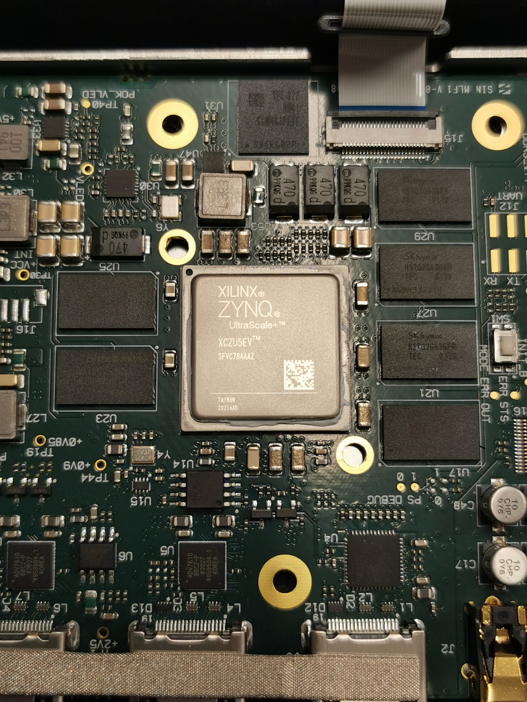
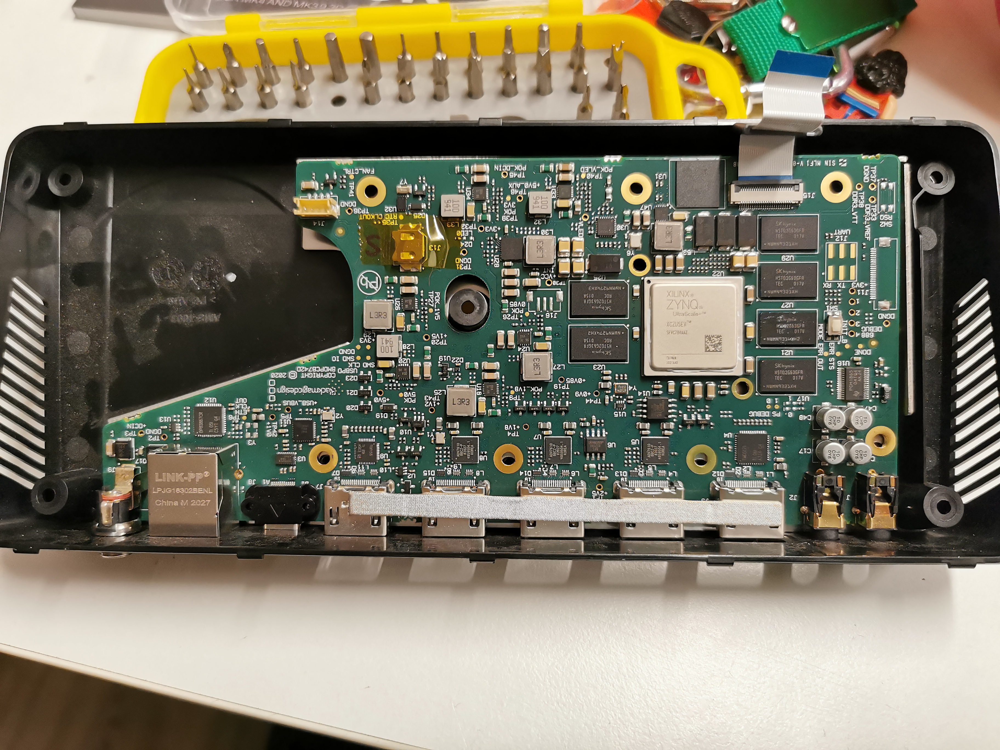
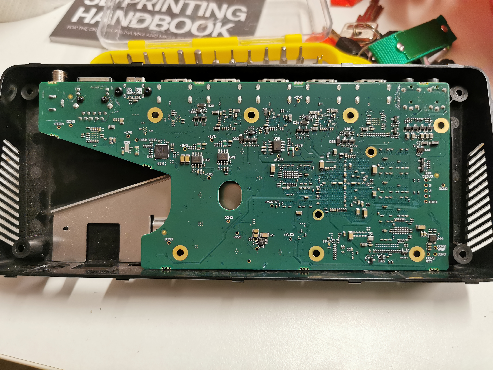
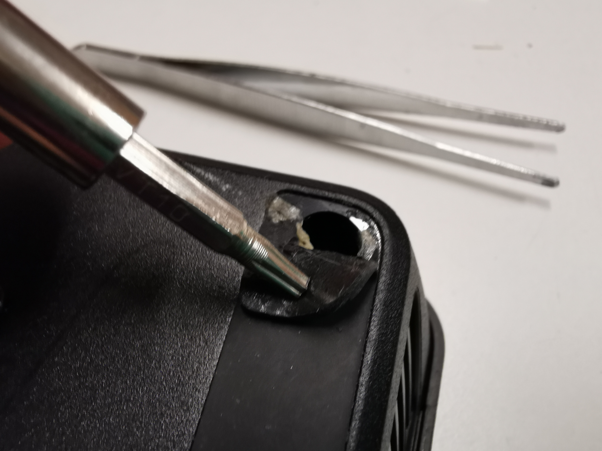
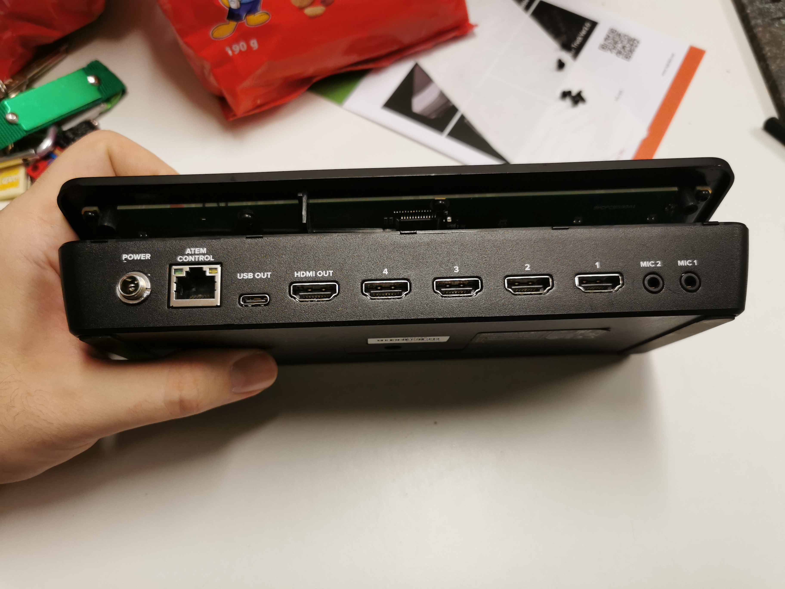
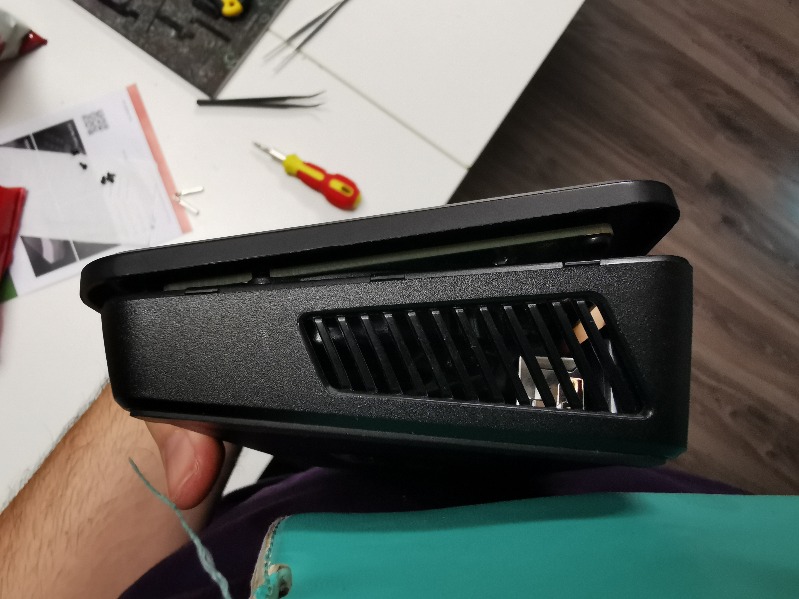
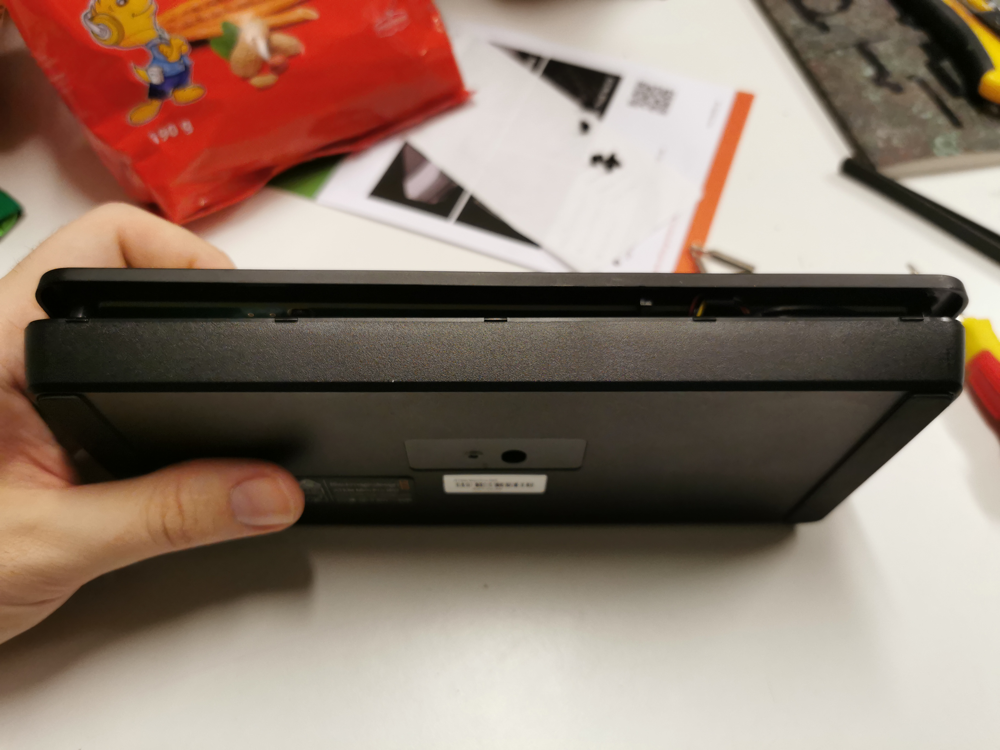
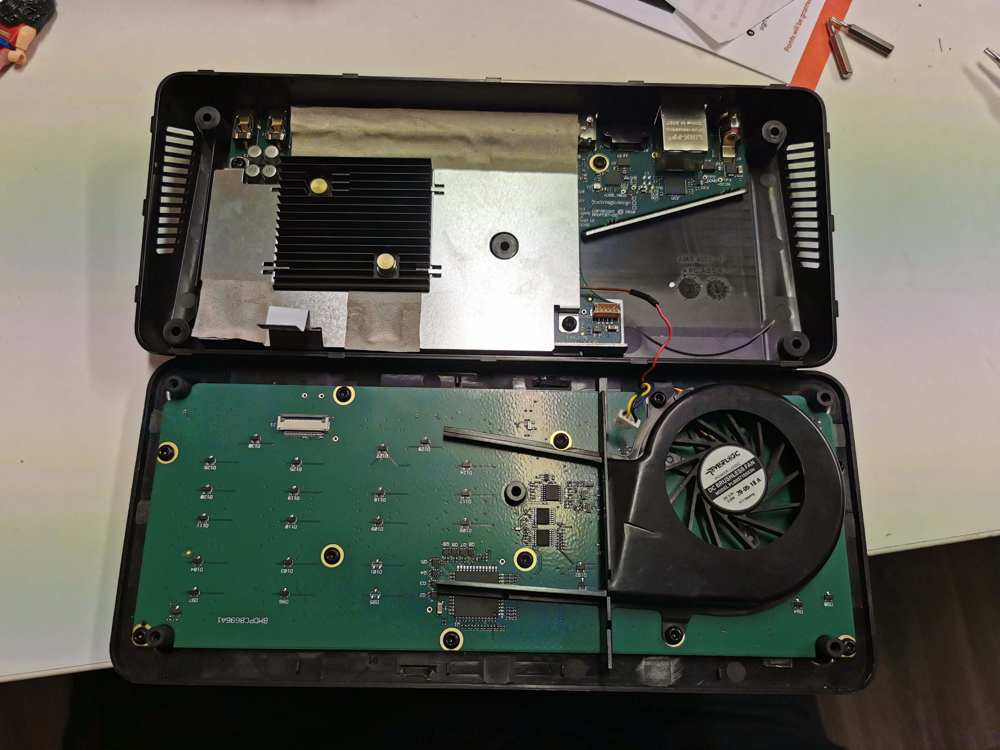

# ATEM-mini-inside-photos
What's inside ATEM Mini Pro ISO. Photos of the main board.

## The heart
Under the heatsink is the main component: a system on chip (SOC) that contains three ARM processors and an FPGA! Atem Mini Pro ISO runs on Xilinx Zynq UltraScale+ EV.

HDMI input 1 goes into TMDS171.
Other HDMI inputs go into ADV7610.

## The main board

There's an exposed and labeled UART and it sends some info during the boot.

There's also an HDMI footprint, but no HDMI connector soldered. I did detect some clock signal on it. It would be interesting to solder an HDMI connector and see what's there.

Back side:

## How to open the case

There are 4 screws in the corners, under the rubber pads. There's another screw in the middle, under the black label. You need a T10 torx screwdriver.

After removing the screws, use a guitar pick and slide it along the edges to release the clips.

Open from the thicker side first, as there are cables at the thinner side that connect the top and bottom board.

Ignore the fan wires, I was experimenting. It's a regular XH plug with 4 wires - red is VCC, black is GND, and the blue and yellow wire are for PWM. If you remove the blue and yellow wire from the connector, the fan will run at full speed all the time. See my other repo for that mod.
